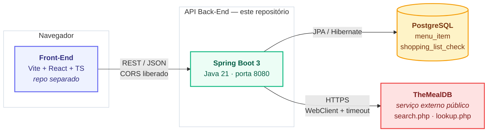
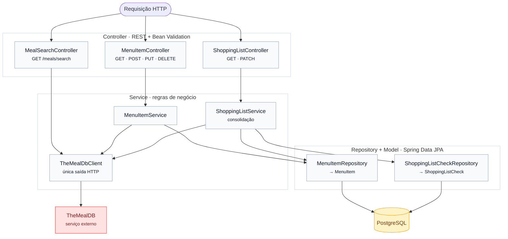
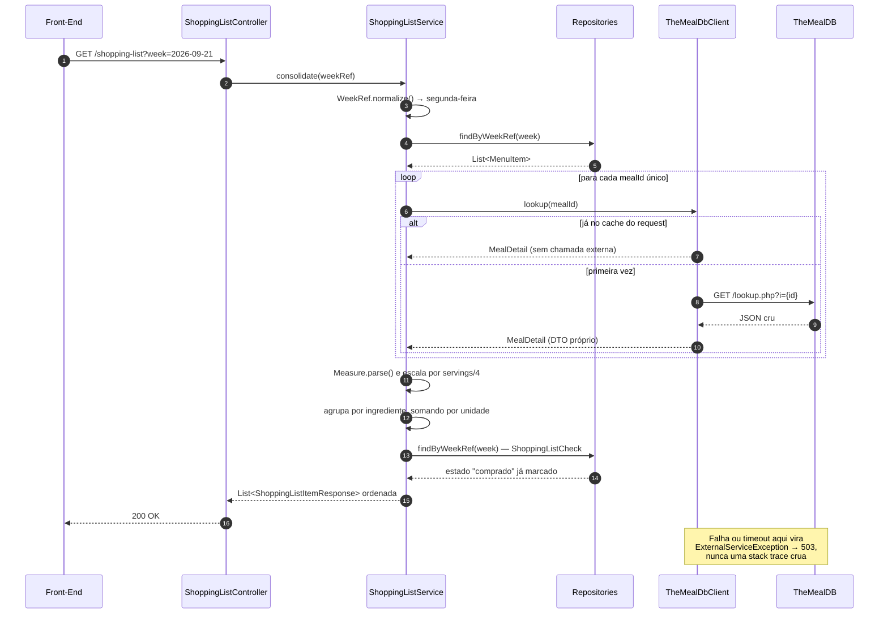
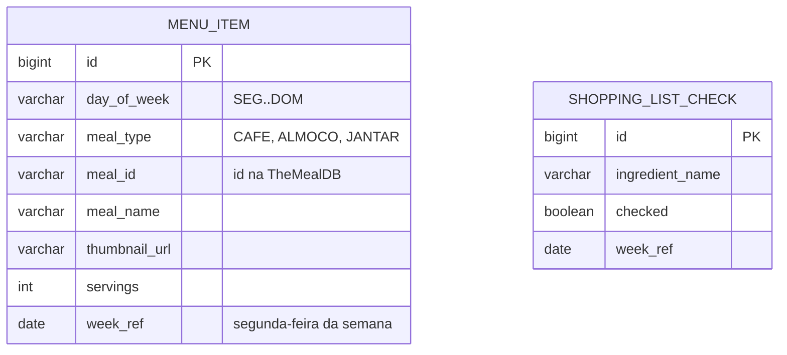

# Arquitetura — Cardápio Semanal API

## 1. Visão de contexto (Cenário 1.1)

Três módulos autônomos. O Front nunca fala com a TheMealDB: todo acesso à externa
passa pela API, que trata e remapeia os dados antes de devolvê-los.

## 2. Camadas internas

Cada camada só conhece a de baixo. `TheMealDbClient` é o **único** ponto do sistema
que faz chamadas HTTP externas.

Ficam fora do fluxo acima, por serem transversais:

- **`GlobalExceptionHandler`** (`@RestControllerAdvice`) — intercepta qualquer exceção
  vinda dos controllers e devolve sempre um `ApiError` padronizado (400, 404, 503, 500).
- **`CorsConfig`** — libera as origens do Front, configuráveis por `CORS_ALLOWED_ORIGINS`.
- **`Measure`** — faz o parsing das medidas não estruturadas da TheMealDB
  (`"1/2 cup"`, `"½"`, `"Dash"`), usado pelo `ShoppingListService`.
- **`WeekRef`** — normaliza qualquer data para a segunda-feira da semana correspondente.

## 3. Fluxo da regra de negócio principal

`GET /shopping-list?week=` — transforma o cardápio da semana numa lista de compras
consolidada. O cache por request evita consultar a externa duas vezes pela mesma receita.

## 4. Modelo de dados

As duas tabelas não têm FK entre si: a lista de compras é **derivada** dos `menu_item`
a cada requisição, e `shopping_list_check` guarda apenas o que o usuário marcou —
ligadas logicamente por `week_ref` + nome do ingrediente. Assim, trocar uma receita ou
o número de porções refaz a lista sem deixar resíduo no banco.
